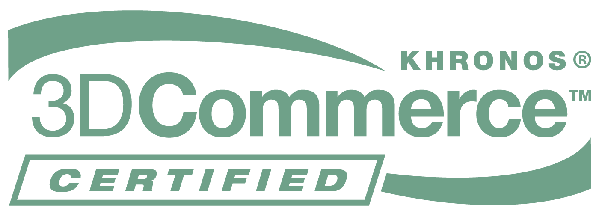

# Khronos 3D Commerce Certification Program

## Background

An overview of the Certification Program is [here](https://www.khronos.org/3dcommerce/certification/).

## Resources

There are two major components to this Khronos 3D CommerceTM Certification repository: 

* [Documents](./documents) - the primary reference for Certification Program details, including how to generate a test submission
* [Models](./models) - the set of glTF models used for Certification.

The glTF models can be viewed with the [3D Commerce Configured Sample Viewer](https://github.khronos.org/3DC-Sample-Viewer).

## Scope

This first release of the Certification Program addresses single products in a well-lit neutral background studio stage, as would be found in a typical single product studio photo-shoot. Future versions of the Certification Program will test a wider range of lighting conditions and product environments. 

## Certified Viewer Registry

A Registry of [certified viewers](https://www.khronos.org/3dcommerce/certification/conformant-products/) is publicly posted.

## Get Involved

If this program is relevant to your business, we warmly invite you to consider joining [Khronos Group](https://khronos.org) to influence and contrbute to this Program's evolution.
