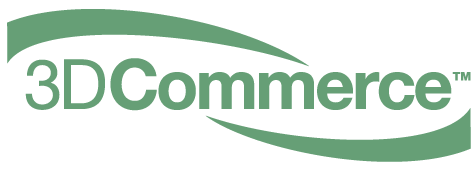

// Copyright (c) 2013-2020 Khronos Group.
//
// SPDX-License-Identifier: CC-BY-4.0

// :regtitle: is explained in
// https://discuss.asciidoctor.org/How-to-add-markup-to-author-information-in-document-title-td6488.html
= 3D Commerce{tmtitle} Viewer Certification Program
:tmtitle: pass:q,r[^™^]
:regtitle: pass:q,r[^®^]
The Khronos{regtitle} 3D Commerce Working Group
:data-uri:
:icons: font
:toc2:
:toclevels: 10
:sectnumlevels: 10
:max-width: 100%
:numbered:
:source-highlighter: coderay
:title-logo-image: 
:stem:

// This causes cross references to chapters, sections, and tables to be
// rendered as "Section A.B" (for example) rather than rendering the reference
// as the text of the section title.  It also enables cross references to
// [source] blocks as "Listing N", but only if the [source] block has a title.
:xrefstyle: short
:listing-caption: Listing

// Table of contents is inserted here
toc::[]

:leveloffset: 1

[[purpose]]
= Purpose

The Khronos 3D Commerce Working Group makes the 3D Commerce Certification Program available to any company that wishes to certify that their Viewers are capable of accurately displaying 3D assets used in e-commerce. The Certification Program enables companies creating end-user experiences to identify and integrate rendering technology that is tested to conform to industry-agreed standards of fidelity and consistency, and companies creating assets identify which platforms have successfully deployed technology that will handle and display those assets correctly.

[[definitions]]
= Definitions

The 3D Commerce Certification Program **(“Program”) **tests applications that load, manipulate, and render 3D assets (“**Viewers”)**. A Viewer may include user interface (UI) features in addition to a rendering engine, but UI elements are not considered as part of the certification process.
Throughout this Agreement, the following terms when capitalized have the following meanings:

*"Certificant"* is a company, regardless of whether that party is a Khronos Member, that has executed the https://members.khronos.org/document/dl/25577[Khronos Certification Agreement] for the Program and has currently paid the Certification Program Fee.

*"Certification List"* is a mailing list that can be subscribed to by Working Group members, current Certificants, and past Certificants that still have Viewers on the Certification Registry. It is used for all notices and discussions related to the Program. It is the responsibility of the Certificant to maintain a valid contact address on the Certification List.

*"Certification Program Fee"* is the annual fee paid, defined below, to enable a Certificant to make Submissions to the Submission Portal for a 12 month period.

*"Certification Registry"* is the public web page maintained by Khronos that lists all Certified Viewers and associated Submissions.

*"Certified Viewer"* is a Viewer that is compliant to the Passing Criteria, is identified in a Submission which has successfully passed the Working Group review and is currently listed on the Certification Registry.

*"Khronos Member"* means an entity that has executed a Khronos Membership Agreement and has not withdrawn its membership.

*"Passing Criteria"* are the set of criteria defined by the Working Group that a tested Viewer must fulfill to become a Certified Viewer. Passing Criteria may be updated over time, but the current Passing Criteria for all new submissions will be clearly defined for all Certificants.

*"Reference Submission"* is an upload of Certificant and Viewer details to the Submission Portal with a reference to a Tested Submission in place of an upload of results from running the Test Package.

*"Removal Request"* is a request from a Certificant to remove one or more of its own Certified Viewers from the Certification Registry.

*"Review Request"* is a request from any organization to review the Submission of a Certified Viewer from another company.

*"Tested Submission"* is an upload of the results of running the Test Package on a Viewer to the Submission Portal, plus any Waiver Statements, with full details of the Certificant, the Viewer, and the environment which was used to create the Test Package, including version numbers.

*"Submission"* is a Reference Submission or a Tested Submission.

*"Submission Portal"* is the Khronos online upload area for Submissions, accessible to all current Certficants.

*"Test Package"* is the set of materials, instructions, and Passing Criteria freely downloadable by anyone including Certificants from the Khronos Public website in order to generate a Submission.

*"Waiver Statement"* is a written identification and description of a potential bug or other issues in a Test Package that causes an anomaly in a test results.

*"Working Group"* is the Khronos 3D Commerce Working Group**.**

[[program-structure]]
= Program Structure

Certificants use the publicly available Test Package to generate Submissions that are uploaded to a Submission Portal for review by the Working Group. If successfully reviewed, the Submission and Viewer details are added to a public Certification Registry and the Certificant can use 3D Commerce Certified trademarks in association with their Certified Viewers. Certificants pay an annual Certification Program Fee to be enabled to make an unlimited number of Submissions.

Certificants may make Submissions for new Viewers or for updated versions of existing Viewers at any time. Submissions typically remain on the Certification Registry, even if outdated, to retain a historical record of when Viewers became certified.

[[certification-program-fee]]
= Certification Program Fee

The Certification Program Fee is $1,500 for Khronos Members and $2,500 for non-members, paid annually, and enables an unlimited number of Submissions by Certficants during that year.

Renewal of the Certification Program Fee becomes due on the anniversary of its first payment.

Viewers continue to be Certified Viewers, even if the Certificant that made the Submission leaves the Program.

[[submissions]]
= Submissions

The following information will be provided in a Submission, in the prescribed formats:

* Certificant Name, Viewer Name, Viewer Version

* Submitter (person) name and Contact email (not displayed), Contact label (displayed)

* Submission ID, Submission Date, Test Package Version

* If a native application: Native Viewer Flag, OS, OS Version, API, API Version

* If a Web viewer: Web Viewer Flag, Browser, Browser Version, API, API Version

* Any necessary Waiver Statements to explain deviance from expected results

* If a Tested Submission: complete set of test results create by running the Test Package

* If a Reference Submission: a link to a Tested Submission from the same Certificant

A Certificant may use the Certification List for questions and support while using the Test Package to generate a Submission.

If a Viewer supports multiple display settings (e.g. for scene luminance, tone mapping, and camera) then the certification is for the default settings for that Viewer.

Viewer UI elements do not need to be removed from submitted images provided that rendered 3D assets are clearly visible.

Once a Submission is complete, the Working Group will carry out its review considering the following factors:

* Do the test results show that the Passing Criteria have been met?

* Are supplied Waiver Statements sufficient to permit deviance from expected results?

The Working Group may contact the submitting Certificant to resolve any questions and issues during review.

A Certificant may withdraw a Submission at any time during review by notifying the Working Group.

Within 30 days of the date of the Submission the Working Group will approve or reject the Submission. If approved, the Submission is uploaded to the Certification Registry and a notice is circulated on the Certification List.

If the Working Group rejects a submission it will explain the reasons for the rejection. The submitting Certificant may then take corrective action and make a new Submission when it believes all issues are resolved. Submission failure notifications are not sent to the Certification List.

The Certificant may request an expedited review for a Submission, but the Working Group cannot guarantee a shortened review period.

[[certification-registry]]
= Certification Registry

The Certification Registry holds an entry for each successful Tested Submission and Reference Submission.

Once a Submission is listed on the Certification Registry it is typically not removed, even if the submitting company is no longer an active Certificant. However, a Submission may be removed from the Certification Registry in two circumstances:

* The company, or its successors, that made a Submission may send a Removal Request for a Submission on the Certification List at any time. The Working Group will remove those Submissions from the Certification Registry within 30 days.

* The company that made a Submission is no longer actively supporting a Viewer and cannot be contacted via the Certification List, the Working Group may remove any Submissions from that company from the Certification Registry at its discretion.

Even if a Submission is removed from the registry, Khronos will maintain a complete record of all Submissions made during the lifetime of the Program.

[[review-requests]]
= Review Requests

Any company, even if not a Khronos Member or a Certificant may initiate a Review Request through identifying issues through a bug report for a Submission from another company on the Certification Registry. The Review Request undergoes a 30-day review, in consultation with the Submission’s Certificant. If the Submission is found to be no longer meeting the Passing Criteria, that Submission is flagged in the Certification Registry with a link to a description of the issue. If the issue is resolved the Submission flag is removed.

[[test-versioning]]
= Test Versioning

The Working Group will regularly issue new versions of the Test Package and will alert all Certificants on the Certification List.

New Test Package versions do not invalidate Submissions on the Certification Registry using older versions.

Three months after the release of a new Test Package minor version, all new Submissions shall be made using that new version.

[[certification-mark]]
= Certification Trademark

The marks that may be used in association with a Certified Viewer under the terms of the Khronos Certification Agreement and the Khronos trademark guidelines available at https://www.khronos.org/legal/trademarks/[Khronos Logos, Trademarks, and Guidelines] are:

* ‘Khronos® 3D Commerce™ Certified’

* The Khronos 3D Commerce Certified logo:

image:./images/3DCommerce-Certified.png[pdfwidth=7in,align=left]

The (R) and “TM” designators must be used as shown above with the first use of the written mark in a document.

Each document that uses the marks must include the following text: “Khronos, 3D Commerce and the Khronos 3D Commerce Certified logo are registered trademarks or trademarks of the Khronos Group Inc.”

Trademark License Term: If all versions of a Viewer are removed from the Certification Registry, it is no longer Certified, the license to the trademarks will terminate, and the above marks must no longer be used in association with it.