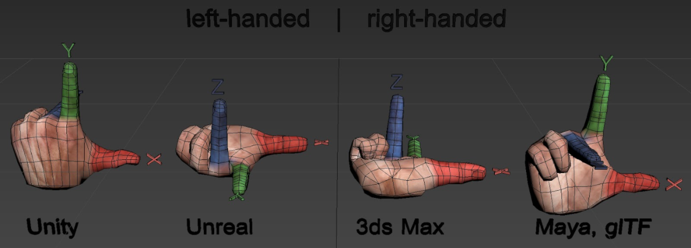
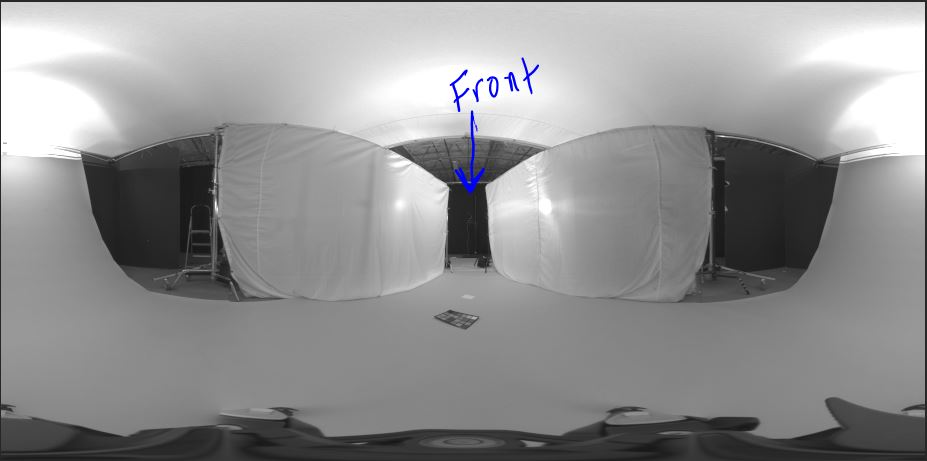
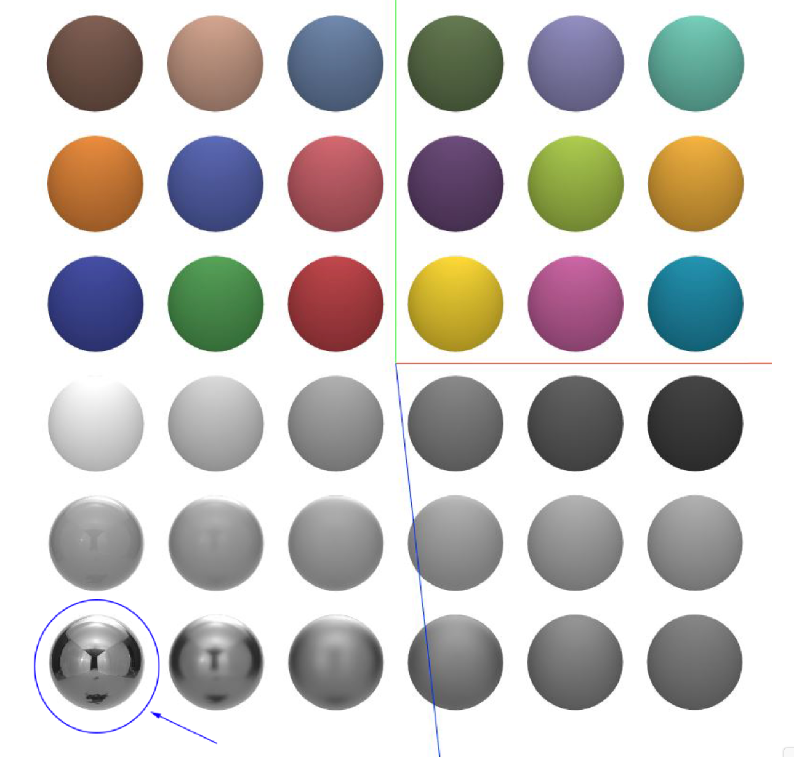
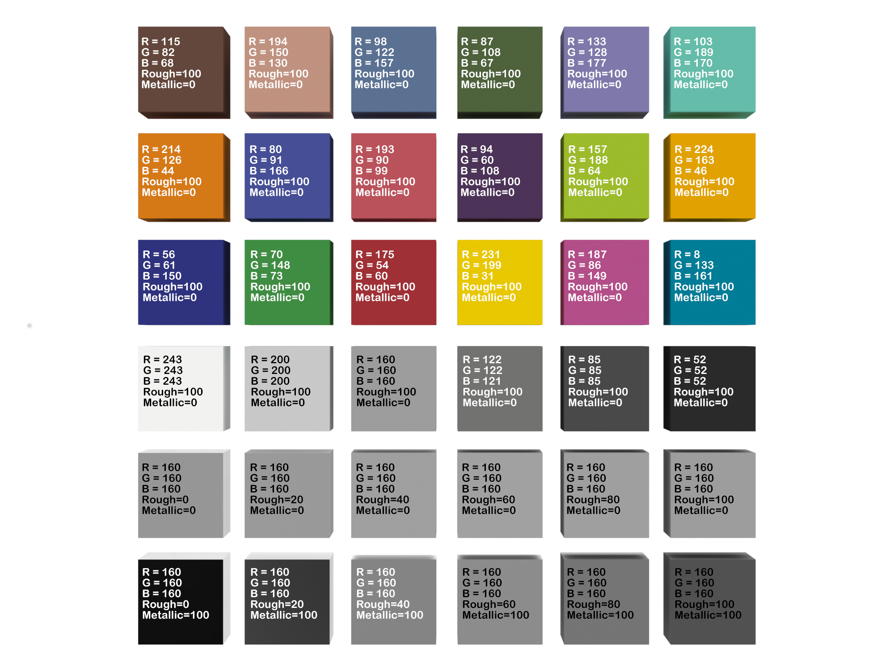

// Copyright (c) 2013-2021 Khronos Group.
//
// SPDX-License-Identifier: CC-BY-4.0

// :regtitle: is explained in
// https://discuss.asciidoctor.org/How-to-add-markup-to-author-information-in-document-title-td6488.html
= 3D Commerce{tmtitle} Reference Render Creation
:tmtitle: pass:q,r[^™^]
:regtitle: pass:q,r[^®^]
The Khronos{regtitle} 3D Commerce Working Group
:data-uri:
:icons: font
:toc2:
:toclevels: 10
:sectnumlevels: 10
:max-width: 100%
:numbered:
:source-highlighter: coderay
:title-logo-image: image:./images/3DCommerce.png[Logo,pdfwidth=4in,align=right]
:stem:

// This causes cross references to chapters, sections, and tables to be
// rendered as "Section A.B" (for example) rather than rendering the reference
// as the text of the section title.  It also enables cross references to
// [source] blocks as "Listing N", but only if the [source] block has a title.
:xrefstyle: short
:listing-caption: Listing

// Table of contents is inserted here
toc::[]

:leveloffset: 1

[[introduction]]
== Introduction

All rendering done in conjunction with this document is done with real-time rasterizations. Rendering with path-trace algorithms will likely produce higher quality results, but would not fit within the requirements of the 3D CommerceTM Certification Program.

[[contributors]]
== Contributors
See link:contributors.adoc[Contributors] for a list of all people who contributed to the 3D Commerce Certification Program.

[[terms-abbreviations]]
== Terms and Abbreviations

1. IBL: **I**mage **B**ased **L**ighting -
2. Rasterizer renderer - The process of creating a digital image from 3D geometry by mapping the geometry to display pixels without proscribing a particular way to computer the color of those pixels. The color of each pixel is assigned by the shading operation. (see https://en.wikipedia.org/wiki/Rasterisation#Rasterisation_of_3D_images[Wikipedia: Rasterisation])
3. Path trace or Ray trace renderer - An algorithm for generating a digital image by tracing the path of light through the 3D scene from the image plane to all light sources. (see https://en.wikipedia.org/wiki/Ray_tracing_(graphics)[Wikipedia: Ray tracing (graphics)])
4. glTF - **g**raphics **l**ibrary **T**ransmission **F**ormat is a file and wire format for describing a high-quality 3D model with physically based materials.
5. Certificant - An organization that applies to have their viewer certified according to the Khronos Certification Program.
6. KTX: **K**hronos **T**e**X**ture - A Khronos image compressed texture format that supports high dynamic range images with high compression ratios. These images can be directly handled by the GPU. (see https://www.khronos.org/ktx/[Khronos KTX])
7. KTX2 -  KTX version 2
8. PBR: **P**hysically **b**ased **r**enderer - a means for describing and rendering a model based on approximations of physically based parameters. glTF uses the metal/roughness model of the physical world.

[[reference-renders-explained]]
== _Reference_ Renders Explained
A Reference Render is a rasterized image of a Khronos provided glTF test object rendered with the Khronos glTF Sample Viewer. Reference Renders are the target outcome for a Certified Viewer. The Reference Renders are designed to:

1. display the rendered output with a high amount of fidelity to the technical aspects of the input (asset).
1. create continuity with other certified viewers so sellers can be confident that their assets will be represented with accuracy in any Certified Viewer.
1. enable the sharing of assets between companies using Certified Viewers without need for editing.

The certification test will utilize the Reference Renders of three analytical test objects for the simple evaluation of hue, saturation, value, gamut, and material properties rendered in-viewer. It will also require renders of six eCommerce test objects, to ensure the viewer properly combines the aforementioned asset elements and can load a range of glTF features as defined by the glTF 2.0 spec.

[[analytical-lighting]]
=== Analytical Lighting
Unlike traditional imaging methods, such as photography and video, photoreal 3D content creators face the unusual task of validating both their viewing environments and their individual assets to ensure they behave realistically. This is particularly important in eCommerce, where customers will make purchasing decisions based on 3D models and may be dissatisfied with their purchase if the rendered image misleads them in regards to the real-world product. The correct rendered output is a cumulation of asset input and the applied render environment, a relationship which has traditionally been up to each company or creator to decide in isolation. However, in order to form an ecosystem of assets that can be seamlessly shared across companies and platforms, calibration of the rendered environments must stay consistent. When assets are created using the consistent environment as a means of validation, assets naturally achieve consistency as well.

Cohesion between renderers and assets can be achieved through the use of  “analytical environments” in quality assurance checks. We will not be validating assets through this test, only renderers. However, for context one should be familiar with the Khronos https://www.khronos.org/assets/uploads/apis/3DCommerce-Realtime-sset-Creation-Guidelines_Jul20.pdf[Asset Creation Guidelines] before beginning this test. By using a standardized analytical environment to configure a viewer, and validating the configuration by rendering standardized assets, a Certifier can be assured that their Viewer is in compliance with the larger ecosystem of Certified Viewers.

The neutral Image Based Light (IBL) provided for testing is calibrated using luminance values from the site of capture. Spot (luminance in nits) and global (illuminance in lux) readings were taken from the studio environment at the time of shoot, and the HDR image was run through HDRI calibration software to ensure it displays at the luminance of the real world environment. As a result the provided IBL creates an accurate reconstruction of an industry standard eCommerce product imaging environment. This environment is ideal for the wide range of asset creation strategies, and takes into account the possibility of textures being scanned or sourced from a swatch.

The neutral IBL will be provided with instructions for setup (_**see below**_), and must be used in the renders submitted for the Certification Test. The Certification Test validates that a given viewer is able to render imagery within tolerance using the specified analytical IBL environment. One object from the test set will also require 3 additional renders with separate IBLs. These renders are included to ensure the calculation is accurate for a variety of environments, and the initial result is not specific to the neutral IBL itself. This gives confidence that any physically based lighting setup will render in the Certificant’s viewer with a relative adherence to the standard. Once the test is complete the Certificant may adjust their viewer’s lighting and camera settings if desired.

[[pre-filtering-spherical-harmonics]]
=== Pre-filtering and Spherical Harmonics [Informational]

Certifiers may determine their own method for prefiltering the provided HDRI before implementing it as an IBL. The Khronos glTF Sample viewer is currently using an irradiance map, although spherical harmonics may be revisited in V2. Due to the material definition of glTF and its BRDF, one can implement a proper sampling and approximation of lighting for it. In general, physics should define the correct visual outcome. In the Khronos glTF Sample Viewer, the pre-filtered data in use is generated during runtime and implicitly defined in this https://github.com/KhronosGroup/glTF-Sample-Viewer/blob/master/source/shaders/ibl_filtering.frag[shader fragment].

[[color]]
=== Color
The rendering of color in glTF Sample Viewer is optimized for artist workflow, which may include authored colors, scanned assets, swatch assets, pantone colors, and adjustments for PBR safe color compliance. In the Reference Renders colors that are input by the texture maps should display in the rendered environment with relative parity to the input color (aside from lighting or shader contribution). This means if a swatch provided by a manufacturer is applied to a model via the texture map, that swatch should render in the viewer with as little effect from the environment as possible (assuming the scene is lit with the Neutral IBL). This consideration helps assets created and validated using Certified Viewers perform well in a wide variety of lighting environments. The Certificant may achieve the desired output utilizing a method of their choosing. Information on acceptable tolerance for color display deviance can be found in the link:acceptance-criteria.adoc[Acceptance Criteria Document].

[[physically-based-materials]]
=== Physically Based Materials

The Khronos glTF Sample Viewer uses the standard PBR Metallic Roughness shader included with the glTF file format. Each of the test objects were rendered using this shader and extensions from the glTF 2.0 spec. Groups seeking Certification will need to use this standard shader, or a very similar Metallic Roughness shader, to create their renders. This is to rule out the possibility that materials are displaying differently due to the shader rather than the renderer itself. Once Certification is complete Certificants are free to use other shaders and extensions within their viewer.

[[capabilities]]
=== Capabilities

In order to replicate the Reference Renders, a viewer seeking Certification will need to be able to render all capabilities outlined in the glTF 2.0 spec., as well as the following features:

* Transparency
* Textures using more than 1 UV coordinate space (texcoord_0, texcoord_1, etc.)
* The KHR_texture_transform Extension

[[calibrating-viewer-khronos-certified-standard]]
== Calibrating A Viewer to Khronos’ Certified Standard

In order to comply with the certified standard Certifiers must ensure their viewer’s settings recreate the Khronos reference render output as closely as possible. As mentioned above, a Certificant can change their viewer’s lighting and camera settings after the certification process is done and maintain certification. However, major changes to the color management or material behavior including certain post processing effects will invalidate the Certification. It is the responsibility of the Certificant to ensure that changes in the lighting are balanced by adjustment to scene luminance/exposure, camera settings, etc. so that 3D assets display accurately within the given environment. Note that Certificants should perform all adjustments and rendering on a calibrated monitor to ensure the correct result.

[[importing-lighting]]
=== Importing Lighting

Download the link:../models/Neutral.hdr[neutral IBL] and load it into your viewer. You will then position the IBL so that the narrow gap created by the two silks in the image is facing your viewer’s forward axis. Note that different viewers label axis differently and you may need to adjust accordingly. Below is an example of different labeling methods for 3D axis. Your axis can be labeled using any method so long as your IBL is set to have the same relative rotation to the test objects as shown in the test renders.

.Coordinate Systems Use by Different Tools

_**Figure 1:** Illustration showing the different coordinate systems used by some of the more popular 3D tools. Note that Unity and Unreal Engine use left-handed coordinate systems._

The “front” of the IBL is the narrow location between the two silks where a real-world camera would sit in a product photography studio (the center of the below image).

.Proper Placement and Orientation of IBL

_**Figure 2:** Illustration of a properly positioned IBL._

The "back" of the IBL is the grey ramp (seen on the right and left sides of the above image), which belongs behind the rendered object just as a standard photo studio backdrop would. It may be necessary to rotate the IBL upon import in order to align it this way, as different viewers have different default import positions. In order to validate that the IBL position is correct, it may be helpful to observe the reflection of the IBL in the fully metallic sphere of the Spherical Test Object (see circled portion of image below). The reflection of the IBL should be the same as shown in the Reference Render when looking through the glTF file’s custom camera. If not, the IBL should be rotated until it does. In most renderers requiring rotation for this IBL the rotation value is either 92 or -92 degrees.

.Ensuring Proper IBL Rotation

_**Figure 3:** Rotate the IBL until it is aligned as shown in the reflection of the shinny metal sphere in the bottom right._

Once aligned, the skybox created by the HDRI should be hidden in all test renders so that test objects appear on a white background.

[[calibrating-color-material-properties]]
=== Calibrating Color and Material Properties

Once the lighting setup is complete, adjust the viewer to reach the target output for color and materials. It is recommended to use the provided analytical objects to assist in this process. It is important not to move the objects from their default import position so that lighting falls over the objects as seen in the Reference Renders. It is recommended to begin with the greyscale test object, which shows a step wedge and a gradient. The Certifier will adjust their viewer settings to ensure the viewer renders the full gamut of greyscale values. The steps and gradient should also transition from white to black at a similar rate as seen in the Reference Render.

Once the correct greyscale output has been achieved, it is recommended that color and material properties are addressed. The sphere and cube arrays represent the sRGB values that would typically be found on a standard photography calibration chart. There are two additional rows which show a range of roughness and metallic values. The display of these values in the Reference Renders is the target output, and the acceptable deviance from these values from a certified viewer is explained in the Acceptance Criteria Document.

Below is a chart of the input (texture map) values for each object in the array for the Rectilinear and Spherical Analytical Objects. The values for the spheres are the same as the cubes, with each sphere matching the cube in its respective position. Lighting contribution may create some variation between the input colors below and the rendered output; while the rendered values will not be 100% accurate to those listed below, each object should render as close as possible to these input values. If the shading contributed by the IBL is too distracting while performing the calibration the Certificant could import an all white IBL image, calibrate to the below color values, and then reimport the Certification neutral IBL to check their work against the Reference Renders.

.Approximate Correct Colors after Rendering

_**Figure 4:** Rendered cubes should approximate the colors indicated in the chart._

[[copyright-license]]
[[copyright]]
[[license]]
== Copyright and License

Copyright 2021, The Khronos Group Inc.
This Document is protected by copyright laws and contains material proprietary to Khronos. Except as described by these terms, it or any components may not be reproduced, republished, distributed, transmitted, displayed, broadcast or otherwise exploited in any manner without the express prior written permission of Khronos.

Khronos grants a conditional copyright license to use and reproduce the unmodified Document for any purpose, without fee or royalty, EXCEPT no licenses to any patent, trademark or other intellectual property rights are granted under these terms.

Khronos makes no, and expressly disclaims any, representations or warranties, express or implied, regarding this Document, including, without limitation: merchantability, fitness for a particular purpose, non-infringement of any intellectual property, correctness, accuracy, completeness, timeliness, and reliability. Under no circumstances will Khronos, or any of its Promoters, Contributors or Members, or their respective partners, officers, directors, employees, agents or representatives be liable for any damages, whether direct, indirect, special or consequential damages for lost revenues, lost profits, or otherwise, arising from or in connection with these materials.

Khronos® and Vulkan® are registered trademarks, and ANARI™, WebGL™, glTF™, NNEF™, OpenVX™, SPIR™, SPIR-V™, SYCL™, OpenVG™ and 3D Commerce™ are trademarks of The Khronos Group Inc. OpenXR™ is a trademark owned by The Khronos Group Inc. and is registered as a trademark in China, the European Union, Japan and the United Kingdom. OpenCL™ is a trademark of Apple Inc. and OpenGL® is a registered trademark and the OpenGL ES™ and OpenGL SC™ logos are trademarks of Hewlett Packard Enterprise used under license by Khronos. ASTC is a trademark of ARM Holdings PLC. All other product names, trademarks, and/or company names are used solely for identification and belong to their respective owners.