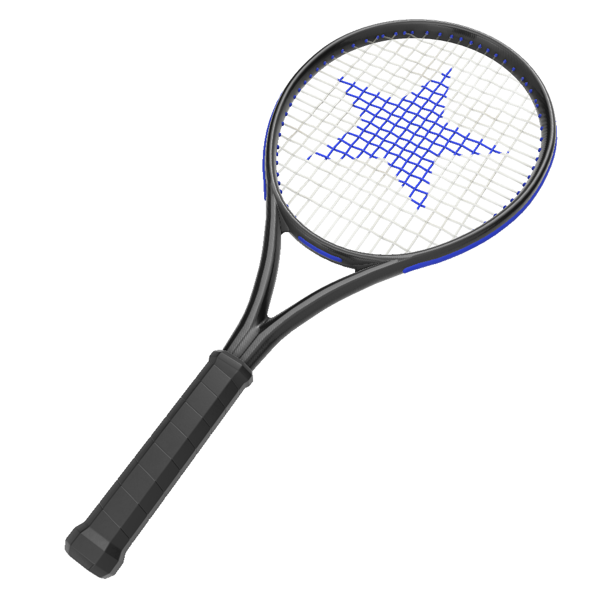

# TennisRacquet

## Screenshot

## Description

Submitted by Duncan Knarr - duncan.knarr@samsung.com
Member company: Samsung (Samsung Research America)

This asset was created for a research project and does not represent an actual product. 

Asset was created with the following process:

1. Modeled in Maya 2019
2. Parts of the model were separated into objects:
* racquet handle
* racquet frame
* racquet strings
* racquet plastic parts
3. Generic blank lambert materials were assigned separately to each sub objects
4. Sub objects were each assigned UV mapping
5. Freeze transformations, and 	delete history were both applied to the entire model
6. Model was exported from Maya as .FBX and imported into Substance Painter 2019
7. 4 PBR Metallic Roughness Materials were created and applied to the 4 sub object parts of the model
8. Maps were baked with Texture Set Settings->Bake Mesh Maps
8. Model was exported to glTF format from Painter by File->Export Textures, then changing "Config" to "glTF PBR Metal Roughness"
9. This exports glTF, glb, and all texture files

All exported files are included here.

## Contributors
See the [Project Contributor list](../../documents/contributors.adoc)

## License Information

CC BY 4.0 International

See the full details of the [Copyrights and License](../../documents/copyright-license.adoc)
