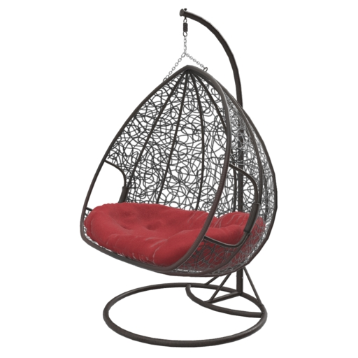
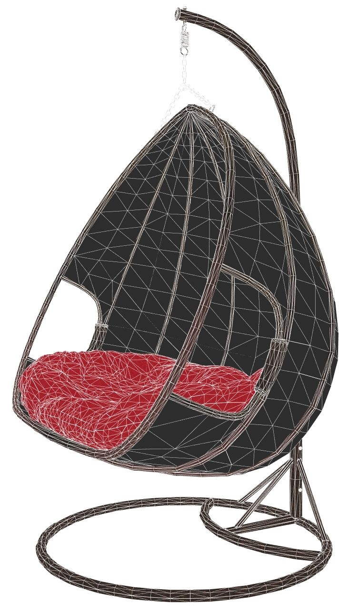
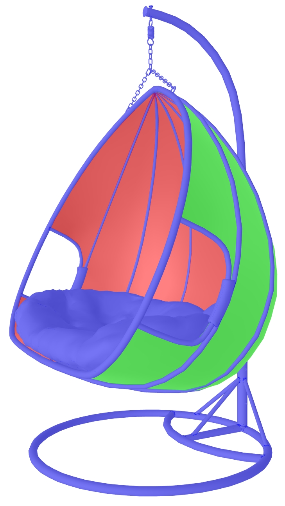

# WickerChair 

## Screenshots

[glTF Sample Viewer](https://github.khronos.org/glTF-Sample-Viewer-Release/) screenshot.

## Description

This model represents a real Wayfair product, [Hayashi Double Swing Chair with Stand](https://www.wayfair.com/outdoor/pdp/bungalow-rose-hayashi-double-swing-chair-with-stand-w002516763.html?piid=695523239), a hanging wicker chair with a fabric cushion. 

There are two materials. The curvy wicker pattern uses Alpha Coverage with MASK mode, and the rest of the model uses a separate material without Alpha Coverage. Both materials reuse the same textures, in the same atlas UV layout. 

The model uses three meshes. The curvy wicker pattern is divided into two meshes, front vs. back for better transparency sorting. The rest of the non-transparent model is the third mesh.

The asset was created using [3ds Max](https://www.autodesk.com/products/3ds-max), exported to glTF using [Max2Babylon](https://github.com/BabylonJS/Exporters#babylonjs-exporters), cameras were added in [Gestaltor](https://gestaltor.io/), then edited in [Visual Studio Code](https://code.visualstudio.com/) with [glTF Tools](https://github.com/AnalyticalGraphicsInc/gltf-vscode#gltf-tools-extension-for-visual-studio-code).

The asset is provided in both ASCII glTF format, and binary GLB format. 

## License Information

Copyright 2021 Wayfair LLC. CC BY 4.0 International https://creativecommons.org/licenses/by/4.0/
