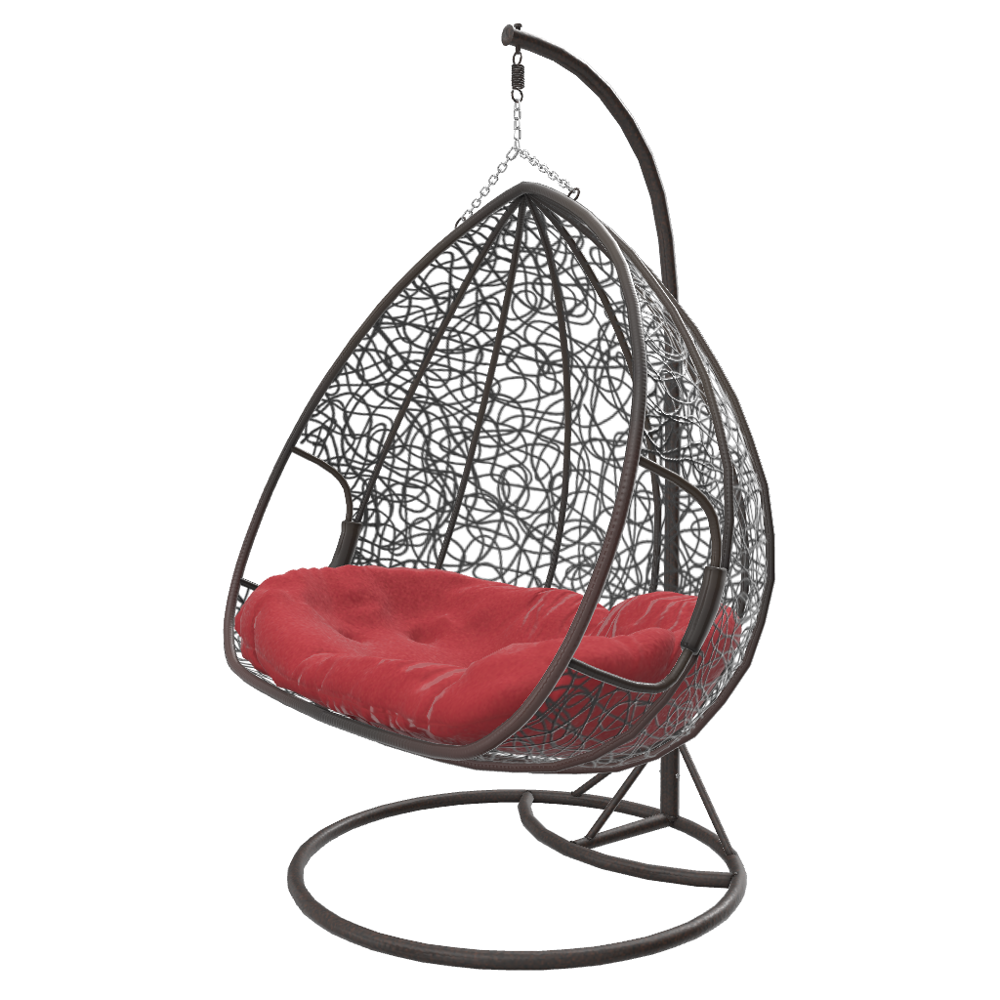

# WickerChair 

## Screenshot

## Description

This model represents a real Wayfair product, [Hayashi Double Swing Chair with Stand](https://www.wayfair.com/outdoor/pdp/bungalow-rose-hayashi-double-swing-chair-with-stand-w002516763.html?piid=695523239), a hanging wicker chair with a fabric cushion. 

The asset was created using [3ds Max](https://www.autodesk.com/products/3ds-max), exported to glTF using [Max2Babylon](https://github.com/BabylonJS/Exporters#babylonjs-exporters), cameras were added in [Gestaltor](https://gestaltor.io/), then edited in [Visual Studio Code](https://code.visualstudio.com/) with [glTF Tools](https://github.com/AnalyticalGraphicsInc/gltf-vscode#gltf-tools-extension-for-visual-studio-code).

The asset is provided in both ASCII glTF format, and binary GLB format. 

## Contributors
See the [Project Contributor list](../../documents/contributors.adoc)

## License Information

CC BY 4.0 International

See the full details of the [Copyrights and License](../../documents/copyright-license.adoc)
