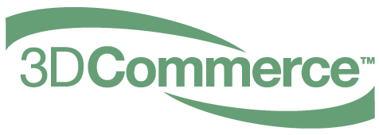

// Copyright (c) 2013-2021 Khronos Group.
//
// SPDX-License-Identifier: CC-BY-4.0

// :regtitle: is explained in
// https://discuss.asciidoctor.org/How-to-add-markup-to-author-information-in-document-title-td6488.html
= 3D Commerce{tmtitle} Certification Test Plan V1.0
:tmtitle: pass:q,r[^™^]
:regtitle: pass:q,r[^®^]
The Khronos{regtitle} 3D Commerce Working Group
:data-uri:
:icons: font
:toc2:
:toclevels: 10
:sectnumlevels: 10
:max-width: 100%
:numbered:
:source-highlighter: coderay
:title-logo-image: 
:stem:

// This causes cross references to chapters, sections, and tables to be
// rendered as "Section A.B" (for example) rather than rendering the reference
// as the text of the section title.  It also enables cross references to
// [source] blocks as "Listing N", but only if the [source] block has a title.
:xrefstyle: short
:listing-caption: Listing

// Table of contents is inserted here
toc::[]

:leveloffset: 1

This document describes the process for creating a 3D Commerce Certification Submission.

This document is used by Certifications in preparing the Certification Submission. This document is part of the Certification Program and knowledge and action of that Program is assumed.

This document is (c) 2021, Khronos Group. Usage and license details are at the end of the document.

[[introduction]]
= Introduction

This document describes the work necessary to create a 3D Commerce Certificant Submission. It is not necessary to be a registered Certificant to read and understand this document; however, some steps are not available unless you have done so.

The audience for this document is people at the Certificant’s organization that are responsible for making the submission. Typically this would be a user-experience (UX) person perhaps in conjunction with a developer of the viewer.

All questions about this document or the procedures described here should be addressed to the 3D Commerce Working Group.

Documents that provide additional information

1. link:certification-program.html[3D Commerce™ Viewer Certification Program]
2. CERTIFICATION AGREEMENT (_link tbd_)
3. link:reference-render-creation-v1.0.html[3D Commerce™ Certification Reference Render Creation]
4. link:acceptance-criteria-v1.0.html[3D Commerce™ Certification Acceptance Criteria]

It is best to read through the entire document before starting to collect the information needed for your Certificant submission. There are naming conventions which must be followed.

[[contributors]]
= Contributors
See link:contributors.adoc[Contributors] for a list of all people who contributed to the 3D Commerce Certification Program.

[[what-you-need-to-start]]
= What you need to start
This section described what is needed to start the Certificant process. Successful completion of the Certificant process allows you to use the 3D Commerce Certified logo and label. It is not necessary to follow the exact order of these steps. Some of the steps cannot be started until all of the previous steps have been successfully completed.

1. Signed legal agreement
2. Payment of fees
3. Download link:certification-test-suite-v1.0.zip[Test Suite] (_ZIP file_)

At this point you run the Test Suite as described below using your viewer.
To continue all of the above steps must be successfully completed.

4. Log onto the Certificant area. Your username & password will be supplied by Khronos once the signed legal agreement and payment have been processed.
5. Go to the Certificant Submission page (link in right menu)
6. The following information about the Certificant’s viewer
   .. Certificant (organization) name
   .. Submitter (person) name
   .. Contact email (not publicly displayed) and label (publicly displayed)
   .. Viewer name & version
   .. Test package version (e.g., V1.0)
   .. Application type information
       ... Native: OS, OS Version, API, API Version
       ... Web (browser): Browser, Browser Version, API, API Version
   .. Any necessary Waiver Statements to explain deviance from expected results
   .. Submission type information

       ... Tested: complete set of test results create by running the Test Package
       ... Reference: a link to a Tested Submission from the same Certificant
7. The version of the Test Suite you are using in 3 (above).
8. The ZIP (.zip) or TarBall (.tar.gz or .tgz) file containing the test results as described below.

Once all of the above information has been uploaded to the Khronos servers, the 3D Commerce Working Group is notified of the submission. They will review the material and make a determination of success or incomplete according to the process described in the Program document. All questions should be directed to the certificant mailing list.

[[How-to-Create-the-test-results]]
= How to Create the Test Results

It is necessary to generate screen captures of the model renderings. It is the responsibility of the certificant to provide and use software that will do that in a manner that preserves the fidelity of your viewer’s rendering system and creates an image file in PNG format. Each capture should be full screen with at least 1024 pixels in short direction with the model centered in the capture. It is not required that the capture be a square image. Any image that falls within the minimum and maximum ranges AND preserves the rendered model’s aspect ratio is sufficient. The preferred size is 1024 x 1024. The capture must be saved as PNG with 24 bit color (RGB with 8 bits per pixel per color).

The process for generating a capture for each model is the same. Each model file includes the predefined camera definition that must be used. All models are lit with the same IBL that is included in the Test Suite. The IBL is oriented as described in the Render Creation document.

The Reference Render document describes in detail the setup for each model. For the convenience of the reader, the most main features are summarized here

[[rendering-requirements-guidelines]]
== Rendering requirements & guidelines

The 3DCommerce certified viewers are expected to render Physically Based materials and assets described in the glTF format properly. For this, the underlying engine of the viewer must provide multiple rendering features listed in a non-exhaustive manner below.

* GLTF support for metallic-roughness workflow and the KHR_texture_transform extension
* Image Based Lighting
* Physically Based Camera with position, orientation and exposure control

[[scene-setup-requirements]]
== Scene setup requirements

In order to generate Test Results that match the Reference Renders a viewer must expose a certain number of scene configuration parameters that are listed in a non-exhaustive manner below.

* Background color, must be set to 0xFFFFFF
* IBL direction and intensity, see Importing Lighting from the link:https://docs.google.com/document/d/1kyBlAfk8944Hm9yyAHCL9PVM-ZsTxOz5-uwzk8m9axE/edit#heading=h.s4wg8ntxghb0[Cert Render Creation Document]
* Camera position, orientation and field of view set from a glTF file.

All models come as glTF packages.(.gltf JSON file plus necessary images).. Some models may also include .glb. The content is the same for both formats. The glTF specification defines the structure of these formats. The models only use features found in glTF V2.0 Core specification plus https://github.com/KhronosGroup/glTF/tree/master/extensions/2.0/Khronos/KHR_texture_transform[KHR_texture_transform extension]. The eight-model test suite tests many aspects of rendering available in the Core specification.

The naming of models and screen shots are important for proper operation of the certification test. Table 1 describes the model and screen file naming convention

.Test Suite Structure
[width="100%",cols="^10%,<40%,<10%,<40%",frame="topbot",options="header"]
|==========================
| **#** | **Description** | **Folder** | **Model**
| >| **Camera Name or (IBL)** 2+>| **Reference Image**
.2+| 1 | Colored cubes |  AnalyticalCubes/ | glTF/AnalyticalCubes.gltf 
  >| _Generated Camera_ 2+>| screenshot/rr-AnalyticalCubes.png
.2+| 2 | Grayscale test swatches |  AnalyticalGrayscale/ | glTF/AnalyticalGrayscale.gltf
  >| _Generated Camera_ 2+>| screenshot/rr-AnalyticalGrayscale.png
.5+| 3 | Colored spheres | AnalyticalSpheres / | glTF/AnalyticalSpheres.gltf 
  >| _Generated Camera_ 2+>| screenshot/rr-AnalyticalSpheres.png
  >| _(Cannon)_ 2+>| screenshot/rr-AnalyticalSpheres-Cannon.png
  >| _(Street)_ 2+>| screenshot/rr-AnalyticalSpheres-Street.png
  >| _(Studio)_ 2+>| screenshot/rr-AnalyticalSpheres-Studio.png
.4+| 4 | Green canvas chair | **GreenChair/** | glTF/GreenChair.gltf
  >| _camera0_ 2+>| screenshot/rr-GreenChair-0.png
  >| _camera1_ 2+>| screenshot/rr-GreenChair-1.png
  >| _camera2_ 2+>| screenshot/rr-GreenChair-2.png
.4+| 5 | Kitchen stand mixer | **Mixer/** | glTF/Mixer.gltf
  >| _camera0_ 2+>| screenshot/rr-Mixer-0.png
  >| _camera1_ 2+>| screenshot/rr-Mixer-1.png
  >| _camera2_ 2+>| screenshot/rr-Mixer-2.png
.4+| 6 | Walking shoe | **Shoe/** | glTF/Shoe.gltf
  >| _camera0_ 2+>| screenshot/rr-Shoe-0.png
  >| _camera1_ 2+>| screenshot/rr-Shoe-1.png
  >| _camera2_ 2+>| screenshot/rr-Shoe-2.png
.4+| 7 | Tennis racket with logo | **TennisRacquet/** | glTF/TennisRacquet.gltf
  >| _camera0_ 2+>| screenshot/rr-TennisRacquet-0.png
  >| _camera1_ 2+>| screenshot/rr-TennisRacquet-1.png
  >| _camera2_ 2+>| screenshot/rr-TennisRacquet-2.png
.4+| 8 | Wicker hanging chair with cushion | **WickerChair/** | glTF/WickerChair.gltf
  >| _camera0_ 2+>| screenshot/rr-WickerChair-0.png
  >| _camera1_ 2+>| screenshot/rr-WickerChair-1.png
  >| _camera2_ 2+>| screenshot/rr-WickerChair-2.png
|==========================

_The name and structure of each test model comprising the test suite. The test suite contains the 8 listed directories with one model per directory (3rd column). All models contain a glTF formatted version. Those in **bold** also contain GLB formatted ones. The directory for GLB files is 'glTF-Binary' instead of 'glTF'. The model filename is shown in the 4th column. Each camera has a reference rendered image file. If there is more than one camera, then the camera name is listed with the model. The AnalyticalSphere model has four IBLs. The name of each IBL is listed in parenthese in the camera column. The image file path is shown in the same row as the camera name. Each folder may contain additional directories to support the model._

The uploaded results file is either a ZIP or Tarball (.tgz or .tar.gz) file containing one folder named according to the Certificant’s organization and containing at least 18 captured images named according to Table 2. Each filename can be customized with any text using the character set [a-zA-Z0-9-_.] (all lower and upper case Roman letters, all Arabic digits, dash, underscore, and dot). If any customized additions are made, those characters must be separated from the required name by an underscore character. All image filenames must end in “.png”.

The folder may contain zero or more text files (.txt) with human-readable text in English that describes or discusses general or specific conditions, exemption, or exceptional circumstance. If the contents relates exclusively to a single render, then the text file should be preceded by the model number (e.g., 03_); otherwise, the filename is up to the Certificant. All text filenames must end in “.txt”

.Required captured file naming convention
[width="75%",cols="^10%,<25%,^10%,<55%",frame="topbot",options="header"]
|==========================
| **#** | **Model** |** Camera #** |  **Rendered Image Required Name**
| 1 | AnalyticalCubes | 0 |  c-AnalyticalCubes.png
| 2 | AnalyticalGrayscale | 0 | c-AnalyticalGrayscale.png
.5+| 3 .5+| AnalyticalSpheres 2+| 
  | (default) | c-AnalyticalSpheres.png
  | (Cannon) | c-AnalyticalSpheres-Cannon.png
  | (Street) | c-AnalyticalSpheres-Street.png
  | (Studio) | c-AnalyticalSpheres-Studio.png
.4+| 4 .4+| GreenChair 2+| 
  | 0 | c-GreenChair-0.png
  | 1 | c-GreenChair-1.png
  | 2 | c-GreenChair-2.png
.4+| 5 .4+| Mixer 2+| 
  | 0 | c-Mixer-0.png
  | 1 | c-Mixer-1.png
  | 2 | c-Mixer-2.png
.4+| 6 .4+| Shoe 2+| 
  | 0 | c-Shoe-0.png
  | 1 | c-Shoe-1.png
  | 2 | c-Shoe-2.png
.4+| 7 .4+| TennisRacquet 2+| 
  | 0 | c-TennisRacquet-0.png
  | 1 | c-TennisRacquet-1.png
  | 2 | c-TennisRacquet-2.png
.4+| 8 .4+| WickerChair 2+| 
  | 0 | c-WickerChair-0.png
  | 1 | c-WickerChair-1.png
  | 2 | c-WickerChair-2.png
|==========================
_If the camera column contains text in parenthese, then that is the name of the IBL. This only applies to the AnalyticalSpheres model. Any Certificant added naming is preceded by an underscore (_ _ _) and inserted prior to the extension. All extensions are .png. For example if the Certificant wished to add the custom name **acme-inc_V1.0**, the result would be **c-AnalyticalCubes_acme-inc_V1.0.png**._

The specifics of generating the rendering of the test models is viewer dependent and this document is unable to describe how to proceed in that level of detail. In each case the following steps must be accomplished:

1. Load model from test suite into your viewer

2. Load the test suite IBL into your viewer so that it lights the model

3. Generate a screen capture or capture from the video feed before the display and save it to disk as a 24-bit RGB PNG using the naming convention described above.

These steps must be done for all 18 cameras for the eight models. Prior to submission you should inspect the screen captures using the Acceptance Criteria document as a guide. This document describes the minimal acceptable conditions for a Certificant submission.

After all of the screen captures have been collected and reviewed, the 18 images should be collected into a single directory and the directory packaged together generating a ZIP or Tarball file. This file is what is submitted to verify correct operation of your viewer.

## How to make a Submission
Step-by-step instruction for entering information into the portal web form

1. Login into the Certification portal using your provided username & password

2. Go to the *Upload Test Results* page available on the **Quick Links** menu.

3. All instructions below are on the *Upload Test Results* page

4. **Certification Name:** Select your company/organization from the drop-down list

5. **Test Upload or Reference Submission**: Select one of the two choices below
     .. ***Reference Submission***, then go to Step 7.
     .. ***Test Upload***, then continue

6. **Test Upload**
   .. **Viewer Name:** Enter the name of your viewer. This should be the public name that is recognized. It will be listed in the results section.
   .. **Viewer Version Number:** The version number (preferably using Semantic Versioning) of the item in Step 6a.

7. **Submitter Name:** Enter your name. This is used for internal tracking purposes and not made public.

8. **Submitter Email:** Enter your email address for public contact about the viewer.

9. **Submitter Label:** Enter the label to be associated with the email in Step 9. This field is public.

10. **Native VIewer or Web Viewer.** Select one of the two choices below
   .. ***Native Viewer***, then go to Step 11
   .. ***Web Viewer***, then go to Step 12

11. **Native Viewer **
   .. **OS:** Enter operating system name (e.g., Android, iOS)
   .. **OS Version:** Enter the version of the operating system that was used for the Certification Test.
   .. Skip Step 12 for Native Viewer

12. **Web Viewer**
   .. **Browser:** Enter the name of the browser that was used for the Certification Test.
   .. **Browser Version:** The version of 12.a that was used.

13. **API:** Select one of the graphic APIs listed in the drop down. If the API that was used in the Viewer is not present, choose ***Other*** and explain in the **Waiver Statements** section.

14. **API Version:** Enter the version of the API from 13

15. **Waiver Statements:** Enter any qualification, notes, clarifications or any other text that may help with the review of your results or the use of your Viewer.

16. **Choose a Password:** Enter an easy-to-remember password. This is to assist in access to your results.

17. **Test Results:** Select the ZIP or Tarball file for upload that contains the Viewer’s test results as described earlier in this document.

18. *Upload Certification Test Results* Click this to upload results and start the review process. Your submission is now complete and no further action is necessary.

= Copyright and License
Copyright 2021, The Khronos Group Inc.
This Document is protected by copyright laws and contains material proprietary to Khronos. Except as described by these terms, it or any components may not be reproduced, republished, distributed, transmitted, displayed, broadcast or otherwise exploited in any manner without the express prior written permission of Khronos.

Khronos grants a conditional copyright license to use and reproduce the unmodified Document for any purpose, without fee or royalty, EXCEPT no licenses to any patent, trademark or other intellectual property rights are granted under these terms.

Khronos makes no, and expressly disclaims any, representations or warranties, express or implied, regarding this Document, including, without limitation: merchantability, fitness for a particular purpose, non-infringement of any intellectual property, correctness, accuracy, completeness, timeliness, and reliability. Under no circumstances will Khronos, or any of its Promoters, Contributors or Members, or their respective partners, officers, directors, employees, agents or representatives be liable for any damages, whether direct, indirect, special or consequential damages for lost revenues, lost profits, or otherwise, arising from or in connection with these materials.

Khronos® and Vulkan® are registered trademarks, and ANARI™, WebGL™, glTF™, NNEF™, OpenVX™, SPIR™, SPIR-V™, SYCL™, OpenVG™ and 3D Commerce™ are trademarks of The Khronos Group Inc. OpenXR™ is a trademark owned by The Khronos Group Inc. and is registered as a trademark in China, the European Union, Japan and the United Kingdom. OpenCL™ is a trademark of Apple Inc. and OpenGL® is a registered trademark and the OpenGL ES™ and OpenGL SC™ logos are trademarks of Hewlett Packard Enterprise used under license by Khronos. ASTC is a trademark of ARM Holdings PLC. All other product names, trademarks, and/or company names are used solely for identification and belong to their respective owners.